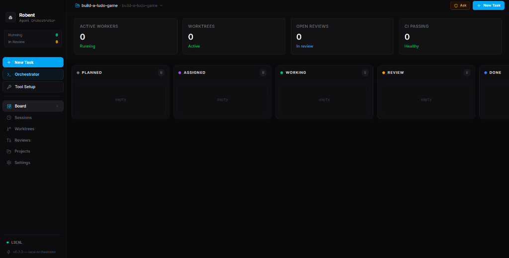

# Robent ⚡

> **The Native Desktop Agent IDE to Supervise & Orchestrate Fleets of Autonomous Coding Agents**

[](https://github.com/Bvs2006/Robent/releases)
[](LICENSE)
[](https://www.electronjs.org/)
[](https://react.dev/)
[](https://www.typescriptlang.org/)
[](https://tailwindcss.com/)
[]()

---

## 📸 Overview



**Robent** is an open-source desktop workstation engineered for developers running multiple autonomous AI coding agents at scale. Instead of juggling isolated command-line terminals or worrying about conflicting edits in your primary repository, Robent acts as your mission control center:

- 🔀 **Spin up isolated Git worktrees** automatically for every single task.
- 🤖 **Dispatch specialized CLI agents** (Claude Code, OpenAI Codex, OpenCode, Antigravity, Aider, Cursor) in parallel.
- 📺 **Watch live, bidirectional ConPTY terminals** with color ANSI streaming.
- 🔁 **Enforce an automated multi-agent code review loop** before merging to your main branch.
- 📦 **Enjoy automatic background updates** directly through GitHub Releases.

---

## 🌟 Key Features

### 🌳 1. Isolated Git Worktree Sandboxing
Running multiple agents directly on your working copy leads to file collisions, git index locks, and broken builds. Robent solves this by creating a dedicated **Git Worktree** for every task:
- Agents build, run tests, and commit code on their own isolated branches.
- Your primary working tree stays clean and untouched.
- Effortlessly preview full diffs, accept and merge with one click, or discard cleanly without leaving stray branches.
- Automatic disk cleanup and worktree pruning when tasks complete.

### 📋 2. Multi-Agent Kanban & Subtask Decomposition
Break complex architectural features down into manageable, independent subtasks:
- **Kanban Pipeline**: Track tasks across `Planned` ➔ `Assigned` ➔ `Working` ➔ `Review` ➔ `Done`.
- **Worker Allocation**: Assign specific agents best suited for each role (e.g., *Claude Code* for architecture and refactoring, *Aider* for targeted bugfixes, *OpenCode* for full-repo autonomous runs).
- **Execution Modes**: Choose between **Full Autonomous** (unattended execution with automated permission bypass) and **Approval Mode** (prompts you before executing critical system commands).

### 🖥️ 3. Real-Time Bidirectional Terminals (ConPTY / xterm.js)
Robent embeds full interactive pseudo-terminals directly in the desktop app:
- Powered by `node-pty` / Windows ConPTY and `xterm.js`.
- Inspect color ANSI outputs, real-time command execution, thinking streams, and tool calls.
- Interact with running agents anytime: send keystrokes, respond to CLI confirmation prompts, or terminate hung processes instantly.

### 🔍 4. Multi-Agent Review Loop & Custom Directives
Quality assurance built directly into the agent workflow:
- Once an agent finishes a task, it automatically transitions to **Review**.
- Run diff inspections side-by-side or inline.
- Configure **Custom Review Directives** (e.g., *"Ensure all new code has unit tests, no console.logs, and satisfies strict TypeScript checks"*).
- Dispatch a secondary reviewer agent to critique the work, suggest revisions, or request changes before human approval.

### 🔌 5. Shared Model Context Protocol (MCP) & Skills Sync
- Configure your preferred MCP servers and agent skills once in Robent.
- Robent automatically injects and synchronizes your MCP tool definitions, configuration files, and custom prompt templates into each agent's active worktree sandbox prior to execution.

### ⚙️ 6. Intelligent CLI Diagnostics & Auth Setup
- Instant discovery of installed coding CLIs on Windows, macOS, and Linux.
- Real-time diagnostic verification of auth status (OAuth tokens, API keys, CLI configs).
- In-app guidance to get any missing tool authenticated and operational.

### 🔄 7. Background Auto-Updates
- Integrated with `electron-updater` and GitHub Releases.
- Robent automatically checks for new desktop releases on launch or on-demand via the command palette.
- Downloads updates silently in the background and prompts for a seamless 5-second restart to apply.

### ⚡ 8. Command Palette & Keyboard First UX
- Press `Ctrl+K` (or `Cmd+K`) from anywhere in the app to open the quick launcher.
- Search tasks, jump to active terminal sessions, toggle worktree views, switch projects, or trigger updates instantly without taking your hands off the keyboard.

---

## 🤖 Supported Agent Drivers

Robent interfaces natively with leading autonomous coding CLIs:

| Agent Driver | CLI Command | Autonomous Flag | Default Mode | Description |
|:---|:---|:---|:---|:---|
| **Claude Code** | `claude` | `--dangerously-skip-permissions` | Subagent / Planner | Anthropic's agentic coding CLI with tool use and codebase navigation. |
| **OpenAI Codex** | `codex` | `--full-auto` | Code Generation | Fast, direct code generation and autonomous task execution. |
| **OpenCode** | `opencode` | `--auto` | Full-stack Autonomous | Open-source agent supporting multi-model setups and local workflows. |
| **Antigravity** | `agy` | `--dangerously-skip-permissions` | Multi-Agent / Research | Google Antigravity's multi-agent planning, research, and coding system. |
| **Aider** | `aider` | `--yes` | Targeted Pair Programming | Renowned git-integrated terminal pair programming tool. |
| **Cursor CLI** | `agent` | `--force` | Interactive Code Editor | Headless terminal agent mode for Cursor workflows. |
| **GitHub Copilot** | `gh copilot` | `shell` | Command Assistant | Shell command and script synthesis via GitHub CLI. |

---

## 🏗️ Architecture & Tech Stack

Robent leverages a modern desktop architecture designed for speed, safety, and native system integration:

```
┌─────────────────────────────────────────────────────────────┐
│                      Robent Desktop                         │
├──────────────────────────────┬──────────────────────────────┤
│       Renderer Process       │         Main Process         │
│   (React 19 + Vite + Tailwind)│      (Electron + Node.js)     │
│                              │                              │
│  • Kanban Board & UI         │  • Isolated Git Worktree API │
│  • xterm.js Terminal Canvas  │  • node-pty (ConPTY / Bash)  │
│  • Zustand State Management  │  • better-sqlite3 Persistence│
│  • Diff Inspection Viewers   │  • electron-updater Service  │
│  • Command Palette (Ctrl+K)  │  • CLI Auth Diagnostics      │
└──────────────┬───────────────┴──────────────┬───────────────┘
               │           IPC Bridge         │
               └──────────────────────────────┘
```

- **Frontend**: [React 19](https://react.dev/), [TypeScript](https://www.typescriptlang.org/), [Vite](https://vitejs.dev/), [Tailwind CSS v4](https://tailwindcss.com/), [Zustand](https://github.com/pmndrs/zustand), [Lucide Icons](https://lucide.dev/).
- **Desktop Runtime**: [Electron 43](https://www.electronjs.org/), [electron-builder](https://www.electron.build/), [electron-updater](https://www.electron.build/auto-update).
- **Process & Terminal Engine**: [`node-pty`](https://github.com/microsoft/node-pty) (Windows ConPTY / POSIX PTY), [`xterm.js`](https://xtermjs.org/) with Fit Addon.
- **Data & Git**: [`better-sqlite3`](https://github.com/WiseLibs/better-sqlite3) for instant local persistence, [`simple-git`](https://github.com/steveukx/git-js) for atomic Git worktree isolation.
- **Protocol**: [`@modelcontextprotocol/sdk`](https://modelcontextprotocol.io/) for MCP server discovery and synchronization.

---

## 🚀 Getting Started

### Prerequisites

- **Node.js**: `v20.x` or `v22.x` (LTS recommended)
- **Git**: `2.20+` (must have Git worktree support enabled)
- **Coding CLI**: At least one supported agent installed (`claude`, `codex`, `opencode`, `agy`, or `aider`)

### Quick Start (Development)

1. **Clone the repository**:
   ```bash
   git clone https://github.com/Bvs2006/Robent.git
   cd Robent
   ```

2. **Install dependencies**:
   ```bash
   npm install
   ```

3. **Launch the development environment**:
   ```bash
   npm run dev
   ```
   > This command compiles the TypeScript sources, starts the Vite HMR server, and launches the Electron desktop application.

---

## 📦 Building & Packaging Installers

To package production installers and portable binaries for your operating system:

```bash
# Typecheck, bundle React frontend, and build Electron installers
npm run build
```

The compiled distributables will be placed in the `release/` directory:
- **Windows**: `Robent Setup <version>.exe` (NSIS installer) & `Robent <version>.exe` (Portable executable)
- **macOS**: `Robent-<version>.dmg` & `Robent-<version>-mac.zip`
- **Linux**: `Robent-<version>.AppImage` & `Robent_<version>_amd64.deb`

---

## ⌨️ Keyboard Shortcuts

| Shortcut | Action |
|:---|:---|
| <kbd>Ctrl</kbd> + <kbd>K</kbd> / <kbd>Cmd</kbd> + <kbd>K</kbd> | Open Command Palette |
| <kbd>Ctrl</kbd> + <kbd>N</kbd> / <kbd>Cmd</kbd> + <kbd>N</kbd> | Create New Task |
| <kbd>Ctrl</kbd> + <kbd>`</kbd> | Toggle Active Worker Terminal |
| <kbd>Esc</kbd> | Close Modal / Exit Focus |

---

## 🤝 Contributing

Contributions make the open-source community an incredible place to learn, inspire, and create. Any contributions you make are **greatly appreciated**.

1. Fork the Project
2. Create your Feature Branch (`git checkout -b feature/AmazingFeature`)
3. Commit your Changes (`git commit -m 'feat: add amazing feature'`)
4. Push to the Branch (`git push origin feature/AmazingFeature`)
5. Open a Pull Request

---

## 📄 License

Distributed under the **Apache-2.0 License**. See [`LICENSE`](LICENSE) for more information.

---

<p align="center">
  Built with ❤️ for the future of agentic software engineering.
</p>
